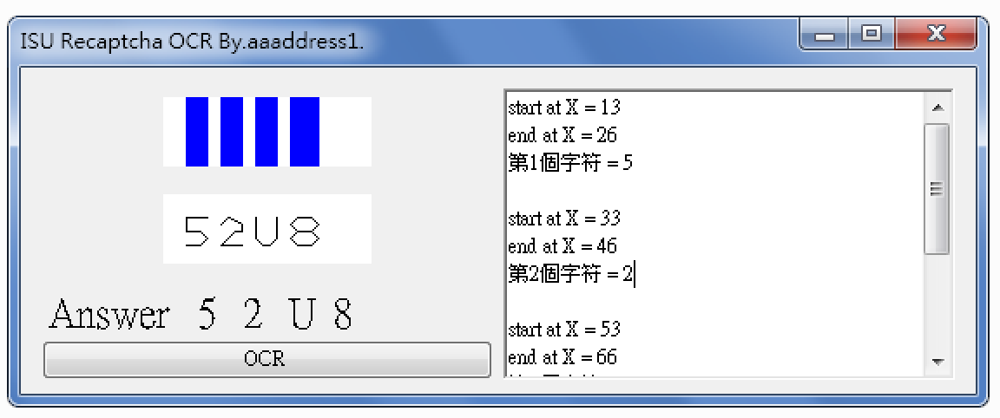

# easyChptchaOCR

針對義守大學驗證碼做二值化、均值處理後得到的驗證碼圖，
可精確簡單做圖像辨識。

算法大概是：
設正在分析的字元起始x座標為 x1

而(x,y)為字元線上的每一個pixel，將一字元上所有pixel做：
t = y * ( y 與 (同x軸上一個pixel的y) 的距離) * ( x 與 (左方最近pixel的x軸) )

將所有pixel做計算後取得t香茄汁和，為該字元之唯一辨識Hash值。
（P.S. 當字元沒有扭曲處理時才可以這樣玩）
